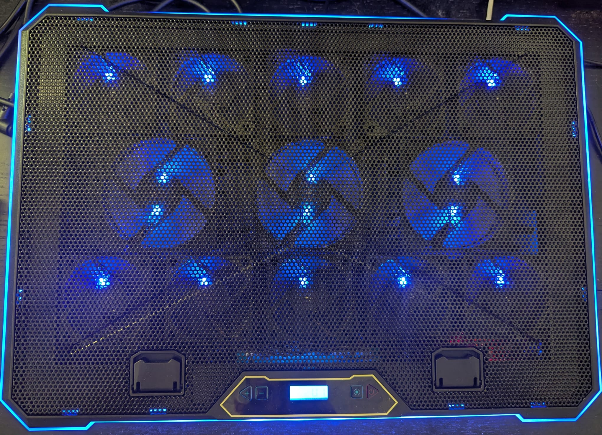
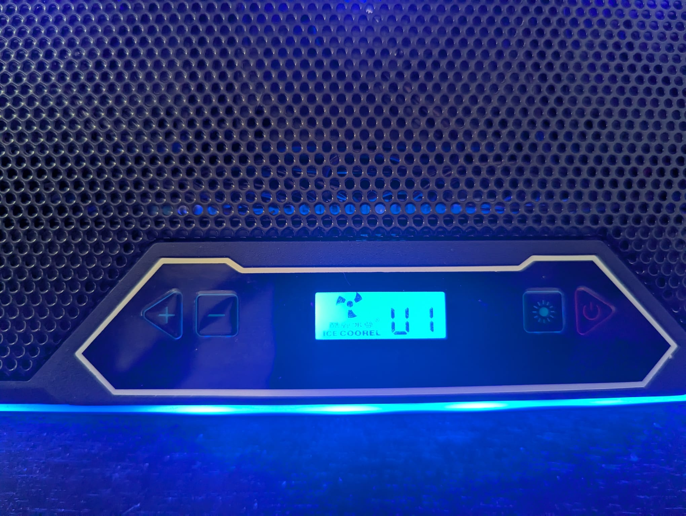
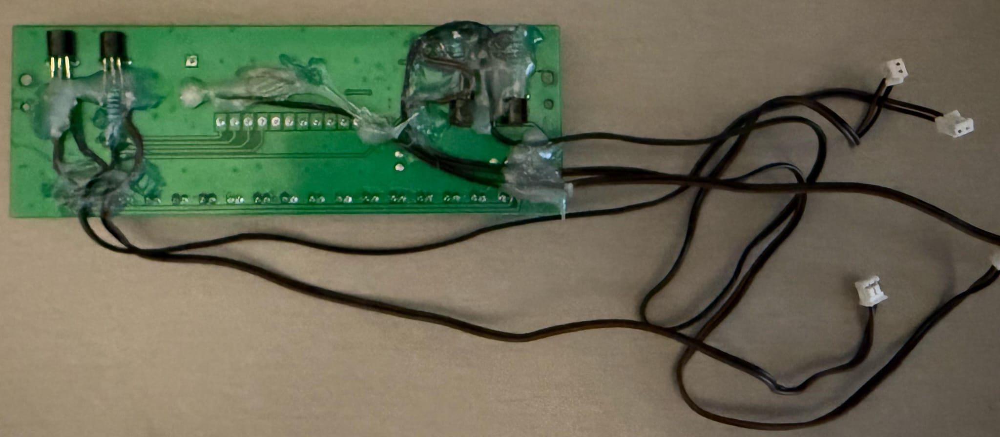
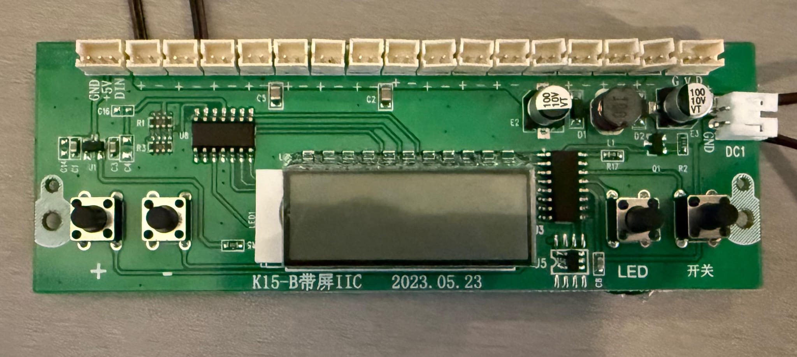

# cooler_than_you

Project for turning a laptop cooler into a "smart" cooler by incorporating an Arduino Pro Micro that presents itself as a USB HID device and communicating with it through USB. Naturally, the code here is highly specific to the laptop cooler used!

Rust workspace layout:

- `device`: the Arduino Pro Micro embedded code to monitor & control the laptop cooler through USB
- `shared`: shared code between `device` and `tray`.
- `tray`: a `libindicator` based system tray driver that uses `rusb` to communicate with the device.

## Project goals

My biggest pet peeve with laptop coolers is that they are not communicating with the host in any way and that makes them inherently dumb. This bothers me the most when it comes to the host going into sleep while the cooler stays on, like when closing a laptop's lid. The initial motivation for this project was thus to accomplish one simple task: turn off the cooler when the host is suspended and turn it back on when the host resumes. However, since I decided to dig into this, I figured I might go further and replicate the hardware controls that my cooler had into software and write some sort of driver to control the device from the host.

There were multiple ways to go about this, but my design decisions were mostly driven by one requirement: I wanted to be as least invasive as possible with the hardware even if it comes at the cost of software complexity. Things would've been much simpler to tackle software-wise if, instead of monitoring the hardware buttons, I would've cut the button traces and re-routed them completely. But mistakes there would've been much harder to correct, so I therefore decided to go with the more "parasitic" approach of monitoring when the buttons are pressed and for how long as well as emulating physical button presses using transistors.

Please note that I'm not saying that my approach is the recommended way to go. As primarily a software engineer it was easier for me to deal with more software and less hardware and this came with the opportunity to reverse-engineer how the cooler works and the challenge to monitor and replicate that. I treated this as a learning experience :).

## Hardware description

The project's main components are the laptop cooler and the Arduino Pro Micro. The laptop cooler was chosen because of its aestethics and decent airflow. Initially I thought of reusing a Digispark ATtiny85 board and [V-USB](https://github.com/obdev/v-usb) as I was only interested in suspend/resume and I had done that before with my old cooler. However, after deciding to go the extra mile with the project, the Pro Micro was chosen because it has a USB controller and the cooler circuit is using 5V and this was the only 5V MCU I had laying around.

### Arduino Pro Micro

### Laptop cooler

The control panel with its four buttons (left to right): speed up, speed down, LED, power. Note that the screen backlight is _ON_ in the picture.

The buttons have the following actions:

- Speed up: increases fan speed (max speed 6) when pressed down at least 40ms
- Speed down: decreases fan speed (min speed 1) when pressed down at least 40ms
- LED:
  - changes LED strip color when pressed at least 40ms and then released
  - turns on/off the LED strip when pressed at least 1400ms
- Power:
  - turns on/off the power when pressed at least 40ms and then released
  - no-op when pressed at least 1400ms

The buttons share their state, in the sense that it's not necessary for the _same_ button to be pressed for 40ms, for instance. Instead, at least a button must be pressed at all times and, in case of multiple buttons being pressed at the same time, the following button priority is enforced: `Speed Up > Speed Down > Power > LED`. Why they behave like that is beyond me, but that's the behavior I observed.

### Hardware connections:

The back of the cooler PCB is where the hardware connections were soldered.
These are comprised of:

- Arduino pin 5 to the screen backlight pin for backlight monitoring
- Arduino pins 6,7,8,9 to the push button pins for buttons monitoring
- BC547 collector and emitter pins to the push button pins to emulate button presses
- Pins 10,16,14,15 to the BC547 transistors base with a 5.7k Ohms resistor in between

Cooler PCB front:

The Arduino Pro Micro is connected through a cut micro USB cable directly to the pins of the USB-A port that the cooler itself is powered from. The USB-A port lives on a small daughter board. This makes it operational whenever the cooler would be. Unfortunately forgot to take pictures before putting it all together, but it's literally four wires soldered to the VCC, D-, D+ and GND pins of the through-hole USB port on the daughter board.

## Custom bootloader

Every time I wanted to flash the microcontroller and test the code I had to get it into bootloader mode. This is typically done by shorting the RESET pin, but I wanted to be able to do this with the whole device assembled. An external button would've done the job but, being a software guy, I decided to do something that required no hardware changes.

I thus flashed a patched bootloader with a very small [diff](https://github.com/bobozaur/ArduinoCore-avr/commit/e5465f52164dc192c15e86c163e946fa0dad45b9). Traditionally, an external reset would put the microcontroller in bootloader mode for 8000 milliseconds. My patch makes the device go into bootloader mode for a quarter of that time (2000ms) after it's powered on. That means that whenever I want to test new code I can just unplug the USB cable, plug it back in and run `cargo run --release`.

## Build Instructions

The `device` crate uses a custom `Cargo` configuration and, for that to apply, building it can be done either by `cd`ing into the package's directory and invoking `cargo run` from there, or, by invoking `cargo` from the workspace root and making use of unstable flags with
`cargo -Z unstable-options -C device run`. The `cargo` command with the unstable flags can be used for the other crates as well.

### Device

1. Install prerequisites as described in the [`avr-hal` README] (`avr-gcc`, `avr-libc`, `avrdude`, [`ravedude`]).

2. Run `cargo run` to flash the firmware to a connected board. `ravedude` looks by default at the `/dev/ttyACM0` device.
   If `ravedude` fails to detect your board, check its documentation at <https://crates.io/crates/ravedude>.

[`avr-hal` README]: https://github.com/Rahix/avr-hal#readme
[`ravedude`]: https://crates.io/crates/ravedude

### System tray

1. Install `libgtk-3-dev` and `libayatana-appindicator3-1`.

2. Run `cargo run` to run the system tray and control the device.

3. Run `cargo deb` (`cargo install cargo-deb` must be called first) to create an installable Debian package for the system tray.

## Credits

System tray SVG icon freely available at: https://www.svgrepo.com/svg/503337/fan-circled.

USB VID and PID used are taken from: https://github.com/obdev/v-usb/blob/master/usbdrv/USB-IDs-for-free.txt. As given the option by their license, the USB device discrimination is, in addition to VID and PID, done by textual name of the manufacturer and product names.

## License

Licensed under either of

- Apache License, Version 2.0
  ([LICENSE-APACHE](LICENSE-APACHE) or <http://www.apache.org/licenses/LICENSE-2.0>)
- MIT license
  ([LICENSE-MIT](LICENSE-MIT) or <http://opensource.org/licenses/MIT>)

at your option.

## Contribution

Unless you explicitly state otherwise, any contribution intentionally submitted
for inclusion in the work by you, as defined in the Apache-2.0 license, shall
be dual licensed as above, without any additional terms or conditions.
