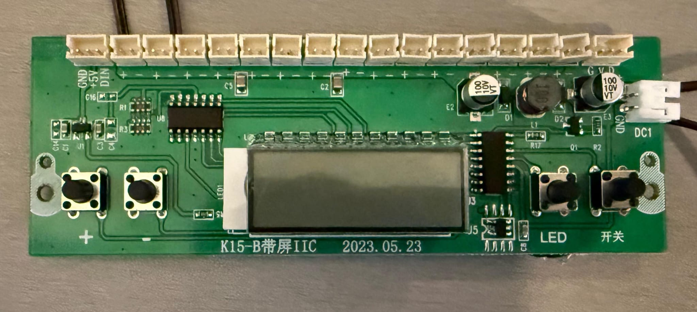

# device

CoolerThanYou device code, developed for an Arduino Pro Micro with an ATmega32u4 running at 5V.
The microcontroller has the following tasks:

- set a known initial state on startup
- emulate button presses in software (through transistors soldered in parallel to the push buttons)
- every 1ms monitor the buttons and update the device state if needed
- when changed, send the device state to the host through USB
- receive commands to execute through USB
- turn off/on the cooler on host suspend/resume

Hardware components used:

- TIMER0: used for triggerring interrupts every 1ms to execute the monitoring code
- Pin 5 as input: used for backlight monitoring
- Pin 6, 7, 8, 9 as input: used for push button monitoring
- Pins 10, 16, 14, 15 as output: connected to the base of BC547 transistors with 5.7k Ohms resistors in between; used to emulate button presses
- USB & PLL: used for the USB interface

The back of the cooler PCB is where the hardware connections were soldered.

Cooler PCB front:

The Arduino Pro Micro is connected through a cut micro USB cable directly to the pins of the USB-A port that the cooler itself is powered from. The USB-A port lives on a small daughter board. This makes it operational whenever the cooler would be. Unfortunately forgot to take pictures before putting it all together, but it's literally four wires soldered to the VCC, D-, D+ and GND pins of the through-hole USB port on the daughter board.

## Build Instructions

1. Install prerequisites as described in the [`avr-hal` README] (`avr-gcc`, `avr-libc`, `avrdude`, [`ravedude`]).

2. Run `cargo run` to flash the firmware to a connected board. `ravedude` looks by default at the `/dev/ttyACM0` device.
   If `ravedude` fails to detect your board, check its documentation at <https://crates.io/crates/ravedude>.

[`avr-hal` README]: https://github.com/Rahix/avr-hal#readme
[`ravedude`]: https://crates.io/crates/ravedude

## Alternative approaches

There were multiple ways to go about this project, but my design decisions were mostly driven by one thing: I wanted to be as least invasive as possible with the hardware even if it comes at the cost of software complexity.

Things would've been much simpler to tackle software-wise if I would've cut the push button traces and re-routed them completely. That way, any button press would go through the Pro Micro. But mistakes there would've been much harder to correct so I decided against it.

### Button press emulation

I have considered using output pins to sink current from the cooler's MCU pins directly instead of soldering transistors in parallel to the push buttons, but I decided against it due to the pin current being around 60mA which seemed too high for the Pro Micro to handle (the max current to sink advised is 20mA).

### Button press monitoring

In retrospect, a better idea than monitoring buttons every 1ms would've been connecting the Pro Micro to one of the unused connectors of the fan grid and reading the voltage using an analog input pin. There's also a second unused connector for the LED strip which could be used to check if the lights are ON/OFF. This would in fact be more precise too because there's no guessing. If the voltage changes, something **definitely** happened. The current button monitoring approach, while seemingly reliable, cannot guarantee that the cooler's state and the state that the Arduino Pro Micro tracks are really in sync.

However, by the time this idea struck me, I had already put the cooler back together and implemented most of the code so I decided to roll with it. Moreover, some functionality would be lost, such as a long press on the power button triggerring a reset to enter bootloader mode or detecting a LED strip color change through a short press on the LED button. Nevertheless, I might revisit this part of the project and do it this way at a later time. For now, the button monitoring works wonders.
